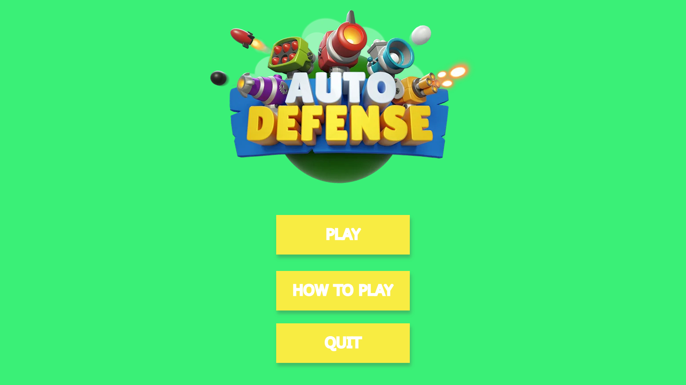

# MyDefender

### Introduction

Le MyDefender est notre 3ème projet graphique. Le but du projet est de créer un jeu type Tower Defense, le but du jeu est de defender un point stratégique en construisant des défenses tout autour d'un chemin. Des vagues d'ennemis vont alors passer par ce chemin afin d'essayer de s'emparer de ce point stratégique.

### Fonctionement

La map est chargée à partir d'un fichier, ce fichier contient les positions des emplacements de défenses ainsi que le chemin. Les enemis vont alors automatiquement suivre le chemin grâce à une simple boucle qui cherche le prochain "morceau" de chemin à parcourir au fur et à meusure de la course. Les emplacements de défenses sont des objets ayant une collision et detectant un clique souris afin de placer la tourelle sélectionnée. Pour afficher un maximum d'entités à l'écrant une puissante gestion de la mémoire à du être conçue.

### Caractéristiques

* Gestion d'évennements
* Sprites animmées
* Les animations et les mouvements ne dépendent pas de la vitesse du PC
* Un menu principal avec différents boutons cliquables
* Un menu pause
* 4 Différents types de défenses
* 2 Effets sonores différents

### Aperçus

Le menu principal du jeu, simple et efficace

.png>)

Ici on découvre le jeu avec le chemin et des ennemis dessus qui partent de la gauche et doivent arriver à la tour à droite. En bas la sélection des moyens de défense.

.png>)

Voici à quoi ca ressemble quand on rajoute des tourelles sur les emplacements.
